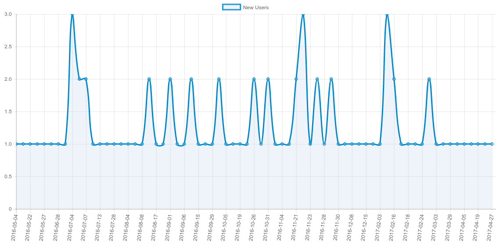

---
author:
- name: Bruce Becker
  email: bbecker@csir.co.za
  institute: CSIR Meraka Institute
title: "Sci-GaIA Deliverable 2.3 : Outcomes of the Web-Based User Forum"
fignos-cleveref: On
fignos-plus-name: Fig.
header-includes: \usepackage{caption}
---

DISCLAIMER

The opinion stated in this report reflects the opinion of the authors and not the opinion of the European Commission.

All intellectual property rights are owned by the Sci-GaIA consortium members and are protected by the applicable laws. Except where otherwise specified, all document contents are: “©Sci-GaIA Project - All rights reserved”. Reproduction is not authorised without prior written agreement.

The commercial use of any information contained in this document may require a license from the owner of that information.

All Sci-GaIA consortium members are also committed to publish accurate and up to date information and take the greatest care to do so. However, the Sci-GaIA consortium members cannot accept liability for any inaccuracies or omissions nor do they accept liability for any direct, indirect, special, consequential or other losses or damages of any kind arising out of the use of this information.

ACKNOWLEDGEMENT

This document is a deliverable of the Sci-GaIA project, which has received funding from the European Union’s Horizon 2020 Programme for Research, Technological Development and Demonstration under Grant Agreement (GA) Nb #654237.

<!-- TOC depthFrom:1 depthTo:6 withLinks:1 updateOnSave:0 orderedList:1 -->

1. [Executive Summary](#executive-summary)
2. [Glossary / List of acronyms](#glossary-list-of-acronyms)
3. [The need for a user forum](#the-need-for-a-user-forum)
	1. [The need for a _new_ user forum](#the-need-for-a-new-user-forum)
	2. [Design Criteria](#design-criteria)
	3. [Sci-GaIA chose Discourse](#sci-gaia-chose-discourse)
		1. [As a means to better interact with communities](#as-a-means-to-better-interact-with-communities)
		2. [As a means to drive identity federations](#as-a-means-to-drive-identity-federations)
4. [The user forum in numbers and figures](#the-user-forum-in-numbers-and-figures)
	1. [Users](#users)
5. [Communities supported on the forum](#communities-supported-on-the-forum)
	1. [Research groups](#research-groups)
		1. [WIMEA-ICT](#wimea-ict)
		2. [iGRID](#igrid)
		3. [MURIA](#muria)
	2. [Other Projects](#other-projects)
		1. [e-infrastructure engineers](#e-infrastructure-engineers)
		2. [DARIAH](#dariah)
6. [Novel uses of the forum](#novel-uses-of-the-forum)
	1. [Discussion site for online learning](#discussion-site-for-online-learning)
	2. [As part of  the Open Science Platform](#as-part-of-the-open-science-platform)
7. [Sustainability of the forum](#sustainability-of-the-forum)
8. [Appendix](#appendix)
9. [References](#references)

<!-- /TOC -->

# Executive Summary

This document describes the Sci-GaIA web-based User Forum, one of the services of the Sci-GaIA Open Science Platform.
This deliverable describes the work done in Task 2.1.
This document will describe the need for such a forum, comparing the situation at the time of the start of the project, with that at the end.
We will show how the forum has supported the scientific and technical communities directly through it's community development role, but also indirectly, by demonstrating the benefit to be had from the others services in the Sci-GaIA Open Science Platform, such as the identity federations and online learning services.
We also maintain the argument that the tools and methodology followed in Sci-GaIA, if not the very service provided, could be very beneficial to any technical community which needs to engage with their users and constituents.

We report on certain quantitative measurements collected over the period of the project and show how it has also qualitatively improved the level of collaboration between new and existing research communities.
 As the project has progressed, so we have ever sought to demonstrate novel and enabling functionality of the forum, and we discuss how the forum has been woven into the platform in support other services.
 We finally argue that the discussion forum is a crucial, often overlooked part of any e-infrastructure, and propose strategies for sustaining and growing the communities supported by it after the project has finished.

# Glossary / List of acronyms

<!-- wouldn't it be luverly if we could use Jinja-2 here to  ? Oh why can't the world stop sucking and be awesome instead ? -->

| Acronym | Definition |
|:---------------|:----------------|
| This | Actually that |

# The need for a user forum

As a Coordination and Support Action, Sci-GaIA had a clear mission : to energise scientific communities, by providing them with tools and services relevant to research in the 21st century.
The project was funded with the acknowledgement that the partners had both access to _communities_ as well as the tools  which they would exploit for success. However  competent and experienced the partners may be though, a common factor was needed - an expression of that energy which  lay latent in the communities.
 Herein lies the need for a forum.

## The need for a _new_ user forum

Online community engagement is a low-yield activity, which requires commitment, cajoling, the right tools and above all momentum to succeed.
Any _new_ forum for a community such as ours which was weak in any of these aspects could be expected to require more effort to sustain that could be expended during the course of  the project with the resources at hand.
For this reason, we conduct a short situational analysis in the interest  of due diligence.

The nature of the web means that there is a great probability that any new service, platform or social network will hardly register in the attention register of the target community. In
order to concentrate effort on community management, several organisers tend to adopt existing social networks, and then hone them towards their particular needs.
The web offers a very rich choice of means for cultivating communities, both "open" and "closed".
Their adoption rates speak for  themselves.
Often communities are enticed by "walled gardens" - platforms which provide closed, configurable environments which can be customised towards any particular end-use.
Examples of these would be creating a Facebook group, a slack instance, or a private Sub-Reddit.
The "Free Code Camp" for example is a worldwide community of  students of all levels interested in developing non-profit start-ups, and uses a series  of Facebook groups for organising their local camps. Slack has seen immense adoption, as has WhatsApp, however, these do not leave a lasting record on the open web.

Arguably the best two platforms on the web for engaging around specific topics or technologies are Reddit and Stack Exchange.
Reddit has roughly
<!-- TODO : How many technical Sub-Reddit are there ? -->
active technical communities (Sub-Reddit).
<!-- TODO : How many Reddit users are there ? -->
Stack Exchange is the technical question and answer site par-excellence on the web, with over
<!-- TODO how many Stack Exchange sites are there ? --> specific sites. The most relevant ones for us had active users
 as follows :
<!-- TODO check the most relevant Stack Exchange sites -->

| Site      | Questions     | Active Users |
| :------------- | :------------- |  :-----------------------|
| Stack Overflow | ~14M | 7.1M |
| Academia | ~19k | 54k |
| ServerFault | ~242k | 309k |
| Open Science^[Currently in Area 51 https://area51.stackexchange.com/proposals/90201/open-science] | 50 |  | 212 |

It would have been very tempting to simply start a Sub-Reddit, or use a tag on Stack Exchange to provide the Sci-GaIA User Forum.
The algorithms which power these services  have evolved over years and via the interactions of hundreds of
millions of users to be as efficient as possible in guiding desired community interaction and user behaviour, as well as to surface quality, relevant information whilst diminish the background noise.
However, in the final analysis, they _do not provide the service required_.
We needed a service over which we could maintain control and agility, putting it to work to serve the specific purposes of the communities we identified, in the time-line allowed by the project.
We discuss these parameters in the  following section.

## Design Criteria

The Sci-GaIA User Forum needed to be based o the best practice and platform in existence.
Managing a community and stimulating online interaction is an extremely demanding activity, with very low success rates, often leading to many anti-social behaviours, or at best apathy and abandonment.
Although we had set modest goals for the uptake of the forum, choosing anything but the best tool would have made reaching even those quite difficult.
As a guiding principle, it was agreed that the forum should be built in a way which could both directly support the other activities of the project, as well as indirectly energise communities in unforeseen ways.

At the start of Sci-GaIA a meeting was held to critically examine the scenario and decide the course of action. We had set out a few technical criteria for the Forum :

  1. **Allow federated access** : anyone should be able to read the forum, whilst anyone wanting to interact on the forum need only sign in at their home institute.
  1. **Permit integration with and mutual support of Sci-GaIA services** : access to data and identities on the forum should be permissible in a programmatic way, so as to be able to integrate the functionality of the forum in other services, so as to support other activities of the project.
  1. **Provide a common experience across the platform** : the forum should not be seen as an adjunct service, but an integral component across the Open Science Platform.
  1. **Provide quantitative insights into user behaviour - adoption, retention, _etc_.** : without intruding on user privacy, the forum should be able to provide insights to the way that the communities which we support behave.
  1. **Be reproducible** : whatever technology was chosen, there should be as little as possible manual configuration requirement, such that the service could be reproduced in other times and locations.

Apart from these hard technical requirements, we wanted to encourage certain behaviours.
Sci-GaIA places a high premium on openness in general, and in particular openness in communication and knowledge sharing.
In some cases, however, a safe space for sharing thoughts ideas and information is needed and to this end the forum should be capable of making certain discussions or groups private only to the members of that group. This also adds to the intimacy and trust required by online communities which do not have face-to-face interactions. Therefore, our web forum should aim to satisfy the following "soft" criteria  too :

  1. **Encourage engagement** : by providing a comfortable, welcoming environment from the very first interaction
  1. **Discourage anti-social behaviour** : by rewarding constructive and collaborative behaviour, giving recognition to activities by users which improve the general health of the community
  1. **Accept new communities** : by providing them with the means to identify and manage themselves
  1. **Recognise the efforts of individuals in "the real world"** : by representing their commitment and contribution on the forum.

These are not functions which can be achieved by a mailing list, a wiki, or walled garden.

## Sci-GaIA's choice of Discourse

The Sci-GaIA proposal, written in 2014, put forth Liferay Message Boards as the tool of choice.
This argument rested on considerations of ease of integration and user experience across various services in a webportal.
However, the idea of developing a portal was reconsidered in the light of changes in architecture of other parts of the science gateway ecosystem.
A move away from centralised, language- and technology-specific _portals_ towards more decentralised _platforms_ comprised of services exchanging data via REST APIs brought great flexibility and was readily adopted.
As part of the due-diligence analysis discussed above, some research was undertaken into the state of the art of online fora.
This research clearly showed that there was on product which went far above all others - the [Civilised Discussion Toolkit - Discourses](http://discourse.org).
Discourse presented several technical advantages over its competitors, but most importantly, responded directly to our design criteria and allowed deep technical integration into other services which would becoome part of the Open Science Platform such as the knowldege base, the edX online courses, the science gateways, _etc_.
The choice of discourse was also a good one in terms of two corrolary goals which we had set in Sci-GaIA - the support of communities of practice, and the development of identity federations.

###  As a means to better interact with communities

### As a means to drive identity federations

# The user forum in numbers and figures

In this section, we summarise the impact of the forum with a few representative metrics.

| Users | 221 |
| Moderators | 7 |
| Discussion Topics | 652 |
| Posts | > 3.1k |

## Users

<!-- Total number of users, and when they registered -->
At the time of writing, the forum has **221** user accounts registered - more than double the initial KPI specified by the project proposal. These users have been registered over time,
<!-- TODO - add the interval numbers -->
.
Diagram shows the new user registrations over time. Here you can clearly see the peaks of registration around our events (winter school, summer school, hackfest).

{#fig:1 width=16cm}

{@fig:1} shows the registration rate of new users to the forum, as measured by the platform itself. This can be compared with {@fig:2}, which is the same metric, measured instead by Google's analytics platform. There is very good overlap between the shape of these two curves of course, however the data from Google show that there is a far larger audience than the logged-in users.

{#fig:2 width=16cm}

See @fig:2

<!-- Where did they come from ? -->

{#fig:3 width=16cm}

See @fig:3

## Trust levels and community leaders

The social engine on discourse allows for very powerful modelling of the desired interactions and responsibilities of the community in real life, as well as online.
Discourses assigns trust levels automatically to users, promoting them and providing them with richer experiences and functionality, as well as access to more private parts of  the forum, based on their online behaviour.
The trust levels are designed to promote positive behaviour, re-inforcing desired bahviour, and discouraging anti-social or abusive behaviour.
All new users are immediately given a trust level of 0, and gain trust (and thus the ability to further engage and improve their experience on the forum) as they post new topics, edit and reply to posts, receive positive feedback from their peers, _etc_.
Note that the metrics by which we guage trustworthiness aim to promote many kinds of positive contributions - both by outspoken extroverts and more timid, introverted people.
Contributions can come in many forms, such as

  * starting topics
  * replying to questions
  * seeking clarification
  * cleaning up others posts for grammar, spelling and content
  * translating topics
  * sharing topics created  by others on social networks in order to increase visibility, _etc_.

As we discuss later, these contrbutions are recognised by specific badges, but taken in their entirety, they the platform to identify active members and reward their contributions appropriately. Table
<!-- TODO insert table ref -->
summarises the requirements for ascending trust levels.

  1. **Trust Level 1 : Users can send private messages.** This level allows users to use the internal messaging system of the forum, and promotes them for engaging rather than just reading. This is unlocked after users have
    1. started 5 topics and
    1. read 30 posts for 10 minutes or more.
  2. **Trust Level 2 :  Edit others' posts** The second trust level level aims to encourage users to ensure quality and promote community support. It is unlocked when users have
    1. written at least 20 posts
    1. spent at least an hour on the forum
    1. given at least one "like" to another users' topic
    1. visited the the site for at least 15 days
  2. **Trust Level 3 : Make your own post a wiki**. This level provides more autonomy to highly-trusted users allowing them to create high-quality content for a wide audience on the forum. It can also be revoked if the member becomes less active over a rolling period^[This has been set to 100 days.]. This level is unlocked after members have
    3. spent more than half of their time on the forum
    4. viewed at least 25 topics and replied to at least 10
    5. Not had more than 5 of their posts flagged by other users
    6. "liked" at least 30 of other members' posts
    7. received at least 20 likes to their own posts.

These levels have been shown to heuristically identify strong leaders who are supportive, provide constructive engatement and encourage others, whilst discouraging abuse and anti-social behaviour, but still leave room for more passive use of the forum by less outspoken members of the community.
These are then easy to identify by the forum staff, which were funded during the course of the project to operate and moderate the forum, and identifies those members who would be best-placed to help ensure the sustainability of the forum, which we discuss in the section "[sustainability of the forum](#sustainability-of-the-forum)"

# Communities supported on the forum

The forum has been designed as an inclusive space for communities to flourish, and as such has accepted many different communities of practice of varying degrees of organisation.
Working close with other partners in WP2, the forum has been used to support the training, development and engagement activities of several communities.
These include research groups, communities of practice and even other funded projects.
The versatility of the platform has made this very easy, allowing for people with similar interests to find each other and coalesce around particular topics or issues.
Typically, these groups and communities were given free reign to use the forum as they please, providing they abide by the terms of use, which as usual favoured structured, civilised discourse, and discourage abuse of all kinds.
A special category was created for each of the communities, with both internal (protected) and publicly-accessible sub-categories. These can be seen at http://discourse.sci-gaia.eu/c/projects .
We describe these groups and how they used the forum below.

## Research groups

Several communities of practice already identified by Sci-GaIA were initially supported :

  * [Weather Information Management in East Africa](http://discourse.sci-gaia.eu/c/projects/wimea-ict) (WIMEA-ICT)
  * [Medicines Utilisation Research in Africa](http://discourse.sci-gaia.eu/c/projects/muria) (MURIA)
  * [Technology Transfer Alliance](http://discourse.sci-gaia.eu/c/projects/tta-al) (TTA)

Of these, the most active by far was the WIMEA-ICT group, with both internal and external sections, moderated by their own community representatives.
WIMEA showed how the forum could  be used to support a distributed research project, both in terms of technical discussion, as well as a means to interact between mentors and students.
The WIMEA community of practice overall started over 50 different discussion topics.
This community had both the most viewed topic^[ The [About topic](http://discourse.sci-gaia.eu/t/joining-the-wimea-ict-group/117/33) generated over 2.3k views], as well as the longest-running topic with an internal discussion regarding an upcoming challenge ran for over a year from September 2015 to December 2016.

## Other communities

Aside from the communities of practice identified by Sci-GaIA during the proposal and initial project phase,

### DARIAH

During the first e-Research Hackfest, one of communities which Sci-GaIA partnered with was [DARIAH](http://www.dariah.eu)^[DARIAH : Digital Research Infrastructure for the Arts and Humanities] - a research community working on digital humanities.
The use of the discussion forum during the hackfest generated much interest, and Sci-GaIA agreed to provide support for DARIAH on it.
A category was created, and users invited, as a service to the community. The demonstration of the speed and simplicity creating welcoming spaces for research communities on the fly. The DARIAH community continues to make use of the forum for aspects of their technical discussions, particularly when needing to collaborate with the developers of  the Open Science Platform and other e-Infrastdructure engineers.

### Emergent communities

Communities are often not as well-defined as the ones we have defined in Sci-GaIA as communities or practice, EC-funded projects or other research groups.
Often, communities coalesce around ideas, themes or undercurrents, and only emerge as communities _per-se_ once the participants in certain discussions realise that they have much in common.
Discourse makes this kind of discovery easier, through the use of topic suggestion, and subscription of topics and tags, as well as the creation of badges to show membership of particular communities.
The "DevOps" category for example has been able to coalesce those with an interest in developing e-Infrastructure services, as well as those who are responsible at sites for operating these services.
Topics in this category are hard to define - they do not focus on a particular group, site, technology, or community, but rather revolve around ways to _support_ and _extend_ the services needed by research communities.
Often

This clearly shows the benefit that the discussion forum can bring to communities of practice, as well as justifies many of the design and other choices made

# Novel uses of the forum

## Discussion site for online learning

## As part of  the Open Science Platform

# Sustainability of the forum

# Appendix

# References

----
