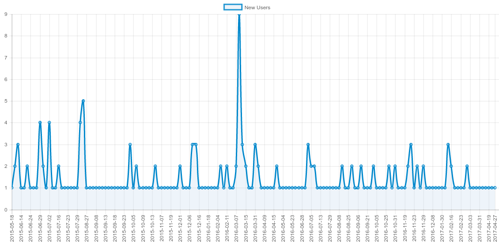

---
author:
- name: Bruce Becker
  email: bbecker@csir.co.za
  institute: CSIR Meraka Institute
title: "Sci-GaIA Deliverable 2.3 : Outcomes of the Web-Based User Forum"
tablenos-caption-name: Table
tablenos-plus-name: Table
tablenos-cleveref: On
fignos-cleveref: On
fignos-plus-name: Fig.
header-includes:
  - \usepackage{caption}
  - \numberwithin{table}{section}
---

<!-- insert the project documentation sheet here -->

|| Project documentation sheet |
| :--- | :---- |
| Project Acronym | Sci-GaIA |
| Project Full Title | Energising Scientific Endeavour through Science Gateways and e-Infrastructures in Africa |
| Grant Agreement | GA #654237 |
| Call Identifier | H2020-INFRASUPP- 2014-2 |
| Funding Scheme | Coordination and Support Action (CSA) |
| Project Duration | 24 months (May 2015 - April 2017) |
| Project Officer | Enrique Gomes, Unit C.1, DG CONNECT   European Commission |
| Co-Ordinator | Dr. Simon J. E. Taylor, Brunel University London (UK) - BRUNEL |
| Consortium Partners | Brunel University London (UK) - BRUNEL   The UbuntuNet Alliance for Research and Education (Malawi) - UBUNTUNET   University of Catania (Italy) - UNICT   The West and Central African Research and Education Network (Ghana) - WACREN   The Royal Institute of Technology (Sweden) - KTH   The Dar es Salam Institute of Technology (Tanzania) - DIT   Karolinska Institutet (Sweden) - KI   CSIR/Meraka Institute (South Africa) - CSIR |
| website | www.sci-gaia.eu |

<!-- end project documentation sheet -->
 

<!-- insert the deliverable document log here -->

|| DELIVERABLE DOCUMENTATION SHEET |
| :--- | :---- |
| Number | Deliverable D2.3 |
| Title | Sci-GaIA Deliverable 2.3 : Outcomes of the Web-Based User Forum |
| Related WP | WP2 |
| Related Task | Task  2.1 |
| Lead Beneficiary | CSIR |
| Author(s) | Bruce Becker (CSIR) |
| Contributor(s) | Roberto Barbera (University of Catania) |
| Reviewer(s) | Roberto Barbera (University of Catania) |
| Nature | R (Report) |
| Dissemination level | PU (Public) |
| Due Date | February 2017 (M22) |
| Submission date | Month DD, YYYY (MXX) |
| Status | Draft |

<!-- end deliverable documentation table -->

 

<!-- document log -->

| Issue | Date | Comment | Author |
| :--- | :--- | :--- | :--- |
| v0.0.0 | March 16 2017 | Initial Commit | Bruce Becker |
| v0.0.1 | 30 April 2017 | First internal review | Roberto Barbera |
| v0.0.4 | 16 May 2017 | Contributions from internal review taken into account | Bruce Becker |
| v0.0.5 | 16 May 2017 | Updates to the glossary | Bruce Becker |
| V0.1.0 | 17 May 2017 | Final internal draft | Bruce Becker |

<!--- end document log -->

 

DISCLAIMER

The opinion stated in this report reflects the opinion of the authors and not the opinion of the European Commission.

<!-- Is this statement compatible with the CC  license ? -->

All intellectual property rights are owned by the Sci-GaIA consortium members and are protected by the applicable laws. Except where otherwise specified, all document contents are: “©Sci-GaIA Project - All rights reserved”. Reproduction is not authorised without prior written agreement.

The commercial use of any information contained in this document may require a license from the owner of that information. (See LICENSE)

All Sci-GaIA consortium members are also committed to publish accurate and up to date information and take the greatest care to do so. However, the Sci-GaIA consortium members cannot accept liability for any inaccuracies or omissions nor do they accept liability for any direct, indirect, special, consequential or other losses or damages of any kind arising out of the use of this information.

ACKNOWLEDGEMENT

This document is a deliverable of the Sci-GaIA project, which has received funding from the European Union’s Horizon 2020 Programme for Research, Technological Development and Demonstration under Grant Agreement (GA) Nb #654237.

 

<!-- TOC depthFrom:1 depthTo:6 withLinks:1 updateOnSave:1 orderedList:1 -->

1. [Executive Summary](#executive-summary)
2. [Glossary / List of acronyms](#glossary-list-of-acronyms)
3. [The need for a user forum](#the-need-for-a-user-forum)
	1. [The need for a _new_ user forum](#the-need-for-a-new-user-forum)
	2. [Design Criteria](#design-criteria)
	3. [Sci-GaIA's choice of Discourse](#sci-gaias-choice-of-discourse)
4. [The forum as part of Sci-GaIA's engagement strategy](#the-forum-as-part-of-sci-gaias-engagement-strategy)
	1. [The forum as means to drive identity federations](#the-forum-as-means-to-drive-identity-federations)
	2. [Online Engagement at Offline Events](#online-engagement-at-offline-events)
	3. [Community pilot role](#community-pilot-role)
5. [The user forum in numbers and figures](#the-user-forum-in-numbers-and-figures)
	1. [Users](#users)
		1. [User Acquisition](#user-acquisition)
		2. [User Provenance](#user-provenance)
	2. [Trust levels and community leaders](#trust-levels-and-community-leaders)
6. [Communities supported on the forum](#communities-supported-on-the-forum)
	1. [Research groups](#research-groups)
	2. [Other communities](#other-communities)
		1. [DARIAH](#dariah)
		2. [Emergent communities](#emergent-communities)
7. [Novel uses of the forum](#novel-uses-of-the-forum)
	1. [Discussion site for online learning](#discussion-site-for-online-learning)
	2. [Questions and Answers](#questions-and-answers)
	3. [Comments engine for the website and blogs](#comments-engine-for-the-website-and-blogs)
8. [Conclusion and Recommendations](#conclusion-and-recommendations)
	1. [Recommendations to other initiatives](#recommendations-to-other-initiatives)
	2. [Sustainability of the forum](#sustainability-of-the-forum)
9. [Appendix](#appendix)
10. [References](#references)

<!-- /TOC -->

# Executive Summary

This document describes the Sci-GaIA web-based User Forum, one of the services of the Sci-GaIA Open Science Platform.
This deliverable describes the work done in Task 2.1.
This document will describe the need for such a forum, comparing the situation at the time of the start of the project, with that at the end.
We will show how the forum has supported the scientific and technical communities directly through it's community development role, but also indirectly, by demonstrating the benefit to be had from the others services in the Sci-GaIA Open Science Platform, such as the identity federations and online learning services.
We also maintain the argument that the tools and methodology followed in Sci-GaIA, if not the very service provided, could be very beneficial to any technical community which needs to engage with their users and constituents. \

We report on certain quantitative measurements collected over the period of the project and show how it has also qualitatively improved the level of collaboration between new and existing research communities.
 As the project has progressed, so we have ever sought to demonstrate novel and enabling functionality of the forum, and we discuss how the forum has been woven into the platform in support other services.
 We finally argue that the discussion forum is a crucial, often overlooked part of any e-infrastructure, and propose strategies for sustaining and growing the communities supported by it after the project has finished.

The deliverable was projected for M23 (April 2017), but the publication has been delayed in order to take into account changes to the consortium during the course of the project, as well as ensure that inputs arising from the User Forum event were included. \

# Glossary / List of acronyms

<!-- wouldn't it be luverly if we could use Jinja-2 here to  ? Oh why can't the world stop sucking and be awesome instead ? -->

| Acronym | Definition |
|:---------------|:----------------|
| AAROC | Africa-Arabia Regional Operations Centre - supporting initiative |
| API | Application Programming Interface - typically a means for expressing the means for interacting with a remote service or application |
| Bootcamp | A brief, focussed event with a development focus around a particular issue or technology. Particularly suited to creating an initial spike in activity or completing a project activity or application |
| DARIAH | Digital Research Infrastructure for the Arts and Humanities - community of practice |
| DevOps | Portmanteau of "Development" and "Operations" , referring to a collaborative engineering and development culture |
| eduGAIN | The worldwide inter-federation run by GEANT. See http://www.edugain.org |
| GARR | The Italian National Research Network |
| GrIDP | A catch-all identity federation for new identity providers, operated by GARR. See [gridp.garr.it](https://idpopen.garr.it)|
| IdP | Identity Provider - in an Identity Federation, the service which authenticates a user's identity |
| IDPOpen | A catch-all identity provider for users with no identity providers, operated by GARR. See [idpopen.garr.it](https://idpopen.garr.it)|
| iGRID | Smart Grid Capacity Development and Enhancement - community of practice |
| ISP | Internet Service Provider - internet terminology |
| MURIA | Medicines Utilisation Research In Africa  - community of practice |
| OSP | Open Science Platform - a proposal for an open platform for Open Science workflows. See [www.sci-gaia.eu/osp](http://www.sci-gaia.eu/osp)|
| REST | Representational State Transfer - a standard vocabulary for interacting with remote services |
| Slack | A modern messaging system for teams. See [slack.com](http://www.slack.com)|
| VPN | Virtual Private Network - network technology |
| walled garden | Also known as "closed platform". Referred to online community platforms or social networks. See [description in Wikipedia](https://en.wikipedia.org/wiki/Closed_platform) |
| WIMEA-ICT | Weather Information Management in East Africa - research community |

Table: Glossary {#tbl:glossary}

 

# The need for a user forum

As a Coordination and Support Action, Sci-GaIA had a clear mission : to energise scientific communities, by providing them with tools and services relevant to research in the 21st century.
The project was funded with the acknowledgement that the partners had both access to _communities_ as well as the tools  which they would exploit for success.
However  competent and experienced the partners may be though, a common factor was needed - an expression of that energy which  lay latent in the communities.
Herein lies the need for a forum.  

## The need for a _new_ user forum

Online community engagement is a low-yield activity, which requires commitment, cajoling, the right tools and above all momentum to succeed.
Any _new_ forum for a community such as ours which was weak in any of these aspects could be expected to require more effort to sustain that could be expended during the course of  the project with the resources at hand.
For this reason, we conducted a short situational analysis in the interest  of due diligence.  

The nature of the web means that there is a great probability that any new service, platform or social network will hardly register in the attention of the target community.
In order to concentrate effort on community management, several organisers tend to adopt existing social networks, and then hone them towards their particular needs.
The web offers a very rich choice of means for cultivating communities, both "open" and "closed".
Their adoption rates speak for  themselves.
Communities are often enticed by "walled gardens" - platforms which provide closed, configurable environments which can be customised towards any particular end-use.
Examples of these would be creating a Facebook group, a Slack instance, or a private Sub-Reddit.
The "Free Code Camp"^[Free Code Camp provides many services similar to Sci-GaIA, such as online learning, community support and mentorship. See http://freecodecamp.com] for example is a worldwide community of  students of all levels interested in developing non-profit start-ups, and uses a series  of Facebook groups for organising their local camps.
Slack has seen immense adoption, as has WhatsApp, however, these do not leave a lasting record on the open web^[We discuss how these tools can nevertheless be used in [Section 4.3](#community-pilot-role)]  

Arguably the best two platforms on the open web for engaging around specific topics or technologies are Reddit and Stack Exchange.
Perhaps a possible strategy could be to co-opt one of these platforms ?
For example [`/r/open_science`](https://www.reddit.com/r/Open_Science/) - moderated by members of [ScienceOpen](https://www.scienceopen.org)^[ScienceOpen is a freely accessible research network to discover and evaluate scientific information.] has 1 269 subscribers^[These numbers were obtained at the time of submission and are subject to volatility. Historical metrics are available at [redditmetrics.com/r/openscience](http://redditmetrics.com/r/openscience) ], and has been active since 2009.  

 

[Stack Exchange](https://stackexchange.com) is the technical Q&A site par-excellence on the web, with over 160 specific sites dedicated to focussed communities^[At the time of writing, the figure was 166. New sites migrate out of the Area51 incubation phase periodically. For See [stackexchange.com/sites](https://stackexchange.com/sites)]. The most relevant ones for us had active users as seen in +@tbl:1  

| Site      | Questions     | Active Users |
| :------------- | :------------- |  :----------------------- |
| Stack Overflow | ~14M | 7.1M |
| Academia | ~19k | 54k |
| ServerFault | ~242k | 309k |
| Open Science^[Currently in Area 51 https://area51.stackexchange.com/proposals/90201/open-science] | 50 | 212  |

Table: Comparison of online fora {#tbl:1}  

It would have been very tempting to simply start a Sub-Reddit, or use a tag on Stack Exchange to provide the Sci-GaIA User Forum.
The algorithms which power these services  have evolved over years and via the interactions of hundreds of millions of users to be as efficient as possible in guiding desired community interaction and user behaviour, as well as to surface quality, relevant information whilst diminish the background noise.
Perhaps the most compelling attraction is the _longevity_ of these services, which are almost guaranteed to live past the end of the Sci-GaIA project.  

However, in the final analysis, they _do not provide the service required_.
We needed a service over which we could maintain control and agility, putting it to work to serve the specific purposes of the communities we identified, in the time-line allowed by the project.
We discuss these parameters in the  following section.  

## Design Criteria

The Sci-GaIA User Forum needed to be based o the best practice and platform in existence.
Managing a community and stimulating online interaction is an extremely demanding activity, with very low success rates, often leading to many anti-social behaviours, or at best apathy and abandonment.
Although we had set modest goals for the uptake of the forum, choosing anything but the best tool would have made reaching even those quite difficult.
As a guiding principle, it was agreed that the forum should be built in a way which could both directly support the other activities of the project, as well as indirectly energise communities in unforeseen ways.  

At the start of Sci-GaIA a meeting was held to critically examine the scenario and decide the course of action. We had set out a few technical criteria for the Forum :

  1. **Allow federated access** : anyone should be able to read the forum, whilst anyone wanting to interact on the forum need only sign in at their home institute.
  1. **Permit integration with and mutual support of Sci-GaIA services** : access to data and identities on the forum should be permissible in a programmatic way, so as to be able to integrate the functionality of the forum in other services, so as to support other activities of the project.
  1. **Provide a common experience across the platform** : the forum should not be seen as an adjunct service, but an integral component across the Open Science Platform (OSP)^[Sci-GaIA has developed a holistic view of such a platform, conceived as a open ecosystem. See [www.sci-gaia.eu/osp](http://www.sci-gaia.eu/osp)].
  1. **Provide quantitative insights into user behaviour - adoption, retention, _etc_.** : without intruding on user privacy, the forum should be able to provide insights to the way that the communities which we support behave.
  1. **Be reproducible** : whatever technology was chosen, there should be as little as possible manual configuration requirement, such that the service could be reproduced in other times and locations.

Apart from these hard technical requirements, we wanted to encourage certain behaviours.
Sci-GaIA places a high premium on openness in general, and in particular openness in communication and knowledge sharing.
In some cases, however, a safe space for sharing thoughts ideas and information is needed and to this end the forum should be capable of making certain discussions or groups private only to the members of that group.
This also adds to the intimacy and trust required by online communities which do not have face-to-face interactions.
Therefore, our web forum should aim to satisfy the following "soft" criteria  too :

  1. **Encourage engagement** : by providing a comfortable, welcoming environment from the very first interaction
  1. **Discourage anti-social behaviour** : by rewarding constructive and collaborative behaviour, giving recognition to activities by users which improve the general health of the community
  1. **Accept new communities** : by providing them with the means to identify and manage themselves
  1. **Recognise the efforts of individuals in "the real world"** : by representing their commitment and contribution on the forum.

These are not functions which can be achieved by a mailing list, a wiki, or walled garden.

## Sci-GaIA's choice of Discourse

The Sci-GaIA proposal, written in 2014, put forth Liferay Message Boards as the tool of choice.
This argument rested on considerations of ease of integration and user experience across various services in a web portal.
However, the idea of developing a portal was reconsidered in the light of changes in architecture of other parts of the science gateway ecosystem.
A move away from centralised, language- and technology-specific _portals_ towards more decentralised _platforms_ comprised of services exchanging data via REST APIs brought great flexibility and was readily adopted.
As part of the due-diligence analysis discussed above, some research was undertaken into the state of the art of online fora.
This research clearly showed that there was one product which went far above all others - the [Civilised Discussion Toolkit - Discourse](http://discourse.org).
Discourse presented several technical advantages over its competitors, but most importantly, responded directly to our design criteria and allowed deep technical integration into other services which would become part of the Open Science Platform such as the knowledge base, the OpenEdX online courses, the science gateways, _etc_^[See ["Novel uses of  the forum"](#novel-uses-of-the-forum) below].
The choice of discourse was also a good one in terms of two corollary goals which we had set in Sci-GaIA - the support of communities of practice, and the development of identity federations.
We describe how the forum was used in support of communities of practice in detail below^[See section ["Communities supported on the forum"](#communities-supported-on-the-forum)], but the central nature of identity federations as a means of access to e-Infrastructures merits some discussion on how we used identity federations as the _sole_ means of authentication to this service.

# The forum as part of Sci-GaIA's engagement strategy

Sci-GaIA's messages - promoting the use of science gateways to energise research, recognition and adoption of an e-Infrastructure Commons, the benefits and practice of Open Science, and of course the need for community building - were well-served by the forum.
A few guidelines emerged on exploiting the forum in Sci-GaIA's strategy of engaging various audiences of our key messages.
First amongst these was ensure that the forum put into practice the tools and principles which Sci-GaIA was explicitly promoting.
This meant that access should be open to all, that open communications and discourse should be promoted over private discussion and information exchange wherever possible, that all investment in tools and services should be done with consideration of their post-project sustainability and that communities choosing to adopt these tools should be able to _own_, rather than feel that they are mere subscribers to a service.

## The forum as means to drive identity federations

From the start of the project, a decision was made across all services of the Open Science Platform that access would be exclusively via identity federations.
This choice was made in order to drive the demand for identity providers in regions where there were no identity federations.
Discourse supports authentication via a wide variety of means, using identities from social networks (_e.g._ Google+, Twitter, GitHub to name a few), as well as internal logins, or single sign-on from different services (_e.g._ edX^[Here, we refer to the corporation edX (www.edx.com), not the open source product OpenEdx], or other enterprise login systems).
However, at the start of the project, there was no means for login using credentials from a user's home institute using identity federation.
In order to enable Identity Federation, a small [Flask](https://flask.pocoo.org) application was written in order to handle the [authentication from an external source](https://meta.discourse.org/t/official-single-sign-on-for-discourse/13045) - "DiscourseSSO" ^[The description of this application can be found at http://fmarco76.github.io/single%20sign-on/discourse-sso/] ^[The source code has been released under an Apache-2.0 license on GitHub : https://github.com/fmarco76/DiscourseSSO].
The addition of this to the configuration of the forum allowed it to be added as Service Provider in various identity federations, starting with the Catch-All federation GrIDP, as well as national or regional identity federations, and eventually in the inter-federation eduGAIN^[See [edugain.org](http://www.edugain.org)].
In some cases, the Sci-GaIA forum was indeed the first or largest service in nascent national federations, driving the demand for other services as well as  local identity providers and stimulating the development of these federations as a whole.
**As such, the forum played its part in supporting the work in [Sci-GaIA Task 3.2 - Support the creation of an African Policy Management Authority and the establishment of Identity Federations to be connected to eduGAIN](http://www.sci-gaia.eu/federated-services/)**.  

## Online Engagement at Offline Events

Over the course of the project, Sci-GaIA has held several meetings across the African continent in particular.
Each of these events generated the customary offline discussion and exchange of ideas, in the form of questions from the audience to the presenters, or perhaps more informal discussion during the breaks.
Whilst this interaction between audience and project is extremely useful, it has a very limited duration in time - once the workshop is over, the attendees return to their homes and this interaction essentially stops.
Typically, the means for continuing the discussion in such cases would be to exchange emails - however, this is also a means for _burying_ and _obfuscating_ discussion, since only the recipients of these emails can participate in such discourse.
Indeed, much has been written about the negative effects of email on collaboration^[See _e.g._  https://www.atlassian.com/blog/confluence/collaboration-best-practices-3-reasons-email-hurts-productivity https://hbr.org/2016/02/a-modest-proposal-eliminate-email] and we have expressed how our soft requirements are not satisfied by email in our [design criteria](#design-criteria).
Our engagement strategy has therefore been to highlight the forum as the _default_ communication means with the project, as well as promoting it as a means for collaboration between members of communities which Sci-GaIA supports, during offline events.
The insignificant barrier to entry to using email as a communication device cannot be ignored, and inevitably emails are exchanged between audience and project members.
Instead of ignoring these, we have tried to gently nudge those interested in engaging with the project towards expressing their interest on the forum.
This was typically  done with encouraging, but incomplete responses to those interested in the project, along the lines of :

> Thank you for you interest and questions
> We find this a very interesting topic, which others in the community would be interested in
> We would really appreciate it if you could start a discussion on this topic on the forum where we could further engage on it.

Typically, this just required the correspondent to "cut and paste" their question from their email to a discussion topic.
Of course, in order to ensure that such easy participation, the barrier to entry for using the forum should be exceedingly low - if possible as low as that of simply sending an email.
This was part of the motivation behind using Identity Federations in an ideal world, where the user would simply need to log in using their institutional credentials, in order to gain access.
In the real world, many users did not have access to local identity providers, but the availability of the [catch-all IdP](https://idpopen.garr.it)^[The Catch-All IdP "IdPOpen" is operated by the Italian National Research Network GARR.] and other “guest” IdPs created in the continent thanks to WP3 activities mitigated this to a large extent.

<!-- https://analytics.googleblog.com/2009/08/back-to-basics-direct-referral-or.html -->  

## Community pilot role

Much discussion and chatter takes place in private communication, ever more so given the rise of community chat rooms.
The most pervasive of these is [Slack](http://www.slack.com) - a chat service based on IRC, made all the more powerful through an API allowing integration of almost arbitrary tools.
The ease with which virtual control rooms can be created in Slack, integrating the suite of tools used by any particular community, makes it an irresistible tool.
The downside of such tools, however, is that they tend to pull users' data and interactions into a closed environment, which is detrimental to the commons.
A kind of "tiered" communication model would be desirable, where fast, immediate interaction is had in a slack channel, addressing specific, pressing topics, whilst _discussion_ is gently nudged off into the forum.
Typically this kind of community policy takes shape slowly, and on a case-by-case basis, depending on the community.
Sci-GaIA and AAROC have promoted the policy of gently guiding such discussion towards  the forum, and out of private communications.
This usually takes the role of a "pilot" discussion,  guiding the discussion until it is felt that a public exchange is appropriate^[Almost always the particular issue - which felt very personal to those involved - had wider ramifications.] Whether it was researchers asking for help and support, or issues of policy, or technical matters, the community pilot's job was to attempt to re-frame the issue in a general way, and encourage posting it as a topic of discussion to the forum.
We have recently implemented an automated version of this, whereby a bot monitors certain channels for lengthy discussions, and automatically opens a topic for discussion around that topic on the forum, asking those involved to move their discussion.
The general principle is :
> If something is worth discussing, it's worth discussion in the open

# The user forum in numbers and figures

In this section, we summarise the impact of the forum with a few representative metrics, shown in +@tbl:metrics  

| | |
|:---------:|:-------:|
| Users | 221 |
| Moderators | 7 |
| Discussion Topics | 652 |
| Posts | 3.1k |

Table: Significant metrics of the African e-Infrastructure Discussion Forum {#tbl:metrics}  

## Users

<!-- Total number of users, and when they registered -->
At the time of writing, the forum has **221** user accounts registered - more than double the initial KPI specified by the project proposal. These users have been registered cumulatively over time.
<!-- TODO discussion - what does this number mean ? -->

### User Acquisition

Diagram shows the new user registrations over time. Here you can clearly see the peaks of registration around our events (conferences, winter school, summer school, hackfests)^[In particular the Lagos DevOps Bootcamp (March 2016) where 16 new users were registered in a few days.].

{#fig:1 width=16cm}

{@fig:1} shows the registration rate of new users to the forum, as measured by the platform itself. This can be compared with {@fig:2}, which is the same metric, measured instead by Google's analytics platform. There is very good overlap between the shape of these two curves of course, however the data from Google show that there is a far larger audience than the logged-in users.

{#fig:2 width=16cm}

### User Provenance

<!-- Where did they come from ? -->

While we have provenance of our users from their identity providers in most cases, we also recorded the geographic location of anonymous users from Google Analytics.
This was done for two reasons :

  1. If we observed a positive correlation between forum visits and the location of our events, we could presume that our message was being effectively conveyed to the direct audience.
  2. From the size of the visitor numbers, we could see whether the original message was being re-transmitted by our audience to second- and third-degrees, and we could estimate the level of diffusion of our message.

  The provenance (at the city level)^[As reported by the user's browser and ISP, so barring effects such as VPN or anonymisation techniques. Catania was excluded from this set as this is the location of the service itself, as well as the maintainers and staff. Inclusion of connections from this location would both distort the scale and variation of the true audience.]  of visitors to the forum is shown in @fig:3

{#fig:3 width=16cm}

We can surmise from the image that the main sources of community members is from West, Southern and Eastern Africa.
Good correspondence can be seen between the cities where Sci-GaIA has held events (Lagos, Maputo, Pretoria, Cape Town, Nairobi, Dar es-Salaam, Addis Ababa).
The two large sources in Scandinavia correspond to Stockholm and Oslo respectively, which were the locations of the main partners in some of the supported communities in Sci-GaIA : the TTA, iGRID, MURIA, and WIMEA-ICT.
Here we can see the strong use of the forum by these communities.

## Trust levels and community leaders

The social engine on Discourse allows for very powerful modelling of the desired interactions and responsibilities of the community in real life, as well as online.
Discourse assigns trust levels automatically to users, promoting them and providing them with richer experiences and functionality, as well as access to more private parts of  the forum, based on their online behaviour.
The trust levels are designed to promote positive behaviour, re-reinforcing desired behaviour, and discouraging anti-social or abusive behaviour.
All new users are immediately given a trust level of 0, and gain trust (and thus the ability to further engage and improve their experience on the forum) as they post new topics, edit and reply to posts, receive positive feedback from their peers, _etc_.
Note that the metrics by which we gauge trustworthiness aim to promote many kinds of positive contributions - both by outspoken extroverts and more timid, introverted people.
Contributions can come in many forms, such as

  * starting topics
  * replying to questions
  * seeking clarification
  * cleaning up others posts for grammar, spelling and content
  * translating topics
  * sharing topics created  by others on social networks in order to increase visibility, _etc_.

These contributions are recognised by specific badges, but taken in their entirety, they allow the platform to identify active members and reward their contributions appropriately.

  1. **Trust Level 1 : Users can send private messages.** This level allows users to use the internal messaging system of the forum, and promotes them for engaging rather than just reading. This is unlocked after users have
    1. started 5 topics and
    1. read 30 posts for 10 minutes or more.
  2. **Trust Level 2 :  Edit others' posts** The second trust level level aims to encourage users to ensure quality and promote community support. It is unlocked when users have
    1. written at least 20 posts
    1. spent at least an hour on the forum
    1. given at least one "like" to another users' topic
    1. visited the the site for at least 15 days
  2. **Trust Level 3 : Make your own post a wiki**. This level provides more autonomy to highly-trusted users allowing them to create high-quality content for a wide audience on the forum. It can also be revoked if the member becomes less active over a rolling period^[This has been set to 100 days.]. This level is unlocked after members have
    3. spent more than half of their time on the forum
    4. viewed at least 25 topics and replied to at least 10
    5. Not had more than 5 of their posts flagged by other users
    6. "liked" at least 30 of other members' posts
    7. received at least 20 likes to their own posts.

These levels have been shown to heuristically identify strong leaders who are supportive, provide constructive engagement and encourage others, whilst discouraging abuse and anti-social behaviour, but still leave room for more passive use of the forum by less outspoken members of the community.
These are then easy to identify by the forum staff, which were funded during the course of the project to operate and moderate the forum, and identifies those members who would be best-placed to help ensure the sustainability of the forum, which we discuss in the section "[sustainability of the forum](#sustainability-of-the-forum)"

# Communities supported on the forum

The forum has been designed as an inclusive space for communities to flourish, and as such has accepted many different communities of practice of varying degrees of organisation.
Working close with other partners in WP2, the forum has been used to support the training, development and engagement activities of several communities.
These include research groups, communities of practice and even other funded projects.
The versatility of the platform has made this very easy, allowing for people with similar interests to find each other and coalesce around particular topics or issues.
Typically, these groups and communities were given free reign to use the forum as they please, providing they abide by the terms of use, which as usual favoured structured, civilised discourse, and discourage abuse of all kinds.
A special category was created for each of the communities, with both internal (protected) and publicly-accessible sub-categories. These can be seen at http://discourse.sci-gaia.eu/c/projects .
We describe these groups and how they used the forum below.

## Research groups

Several communities of practice already identified by Sci-GaIA were initially supported :

  * [Weather Information Management in East Africa](http://discourse.sci-gaia.eu/c/projects/wimea-ict) (WIMEA-ICT)
  * [Medicines Utilisation Research in Africa](http://discourse.sci-gaia.eu/c/projects/muria) (MURIA)
  * [Technology Transfer Alliance](http://discourse.sci-gaia.eu/c/projects/tta-al) (TTA)

Of these, the most active by far was the WIMEA-ICT group, with both internal and external sections, moderated by their own community representatives.
WIMEA showed how the forum could  be used to support a distributed research project, both in terms of technical discussion, as well as a means to interact between mentors and students.
The WIMEA community of practice overall started over 50 different discussion topics.
This community had both the most viewed topic^[ The [About topic](http://discourse.sci-gaia.eu/t/joining-the-wimea-ict-group/117/33) generated over 2.3k views], as well as the longest-running topic with an internal discussion regarding an upcoming challenge ran for over a year from September 2015 to December 2016.  

For a fuller discussion of how Sci-GaIA has developed communities of communities of practice, we refer the reader to Section 2.9 of Sci-GaIA Deliverable 2.4 - "Energising Scientific Endeavour: Experiences of Supporting Communities of Practice with Science Gateways and eInfrastructures"

## Other communities

Aside from the communities of practice identified by Sci-GaIA during the proposal and initial project phase, the discussion forum was able to attract other communities not directly supported by Sci-GaIA.
These include EU-funded projects, as well as emergent communities.

### DARIAH

During the first e-Research Hackfest, one of communities which Sci-GaIA partnered with was [DARIAH](http://www.dariah.eu)^[DARIAH : Digital Research Infrastructure for the Arts and Humanities] - a research community working on digital humanities.
The use of the discussion forum during the hackfest generated much interest, and Sci-GaIA agreed to provide support for DARIAH on it.
A category was created, and users invited, as a service to the community. The demonstration of the speed and simplicity creating welcoming spaces for research communities on the fly. The DARIAH community continues to make use of the forum for aspects of their technical discussions, particularly when needing to collaborate with the developers of  the Open Science Platform and other e-Infrastructure engineers.

### Emergent communities

Communities are often not as well-defined as the ones we have defined in Sci-GaIA as communities or practice, EC-funded projects or other research groups.
Often, communities coalesce around ideas, themes or undercurrents, and only emerge as communities _per-se_ once the participants in certain discussions realise that they have much in common.
Discourse makes this kind of discovery easier, through the use of topic suggestion, and subscription of topics and tags, as well as the creation of badges to show membership of particular communities.
The "DevOps" category for example has been able to coalesce those with an interest in developing e-Infrastructure services, as well as those who are responsible at sites for operating these services.
Topics in this category are hard to define - they do not focus on a particular group, site, technology, or community, but rather revolve around ways to _support_ and _extend_ the services needed by research communities.

This clearly shows the benefit that the discussion forum can bring to communities of practice, as well as justifies many of the design and other choices made.

# Novel uses of the forum

As we have shown, the forum has served its purpose as the central online meeting place for communities supported by Sci-GaIA to form, coalesce, interact and evolve.  
As a meeting place, it has been able to knit together people who most likely have already met in real life, providing a means for continually interacting with each other and re-reinforcing social bonds that would weaken otherwise given the distance over time and space between meetings in the physical world.

However, considering the forum merely as a place for online discussion  belies its true capacity for cohesion.
When taken as part of a platform, the forum provides an means to integrate discussion across several spheres the day-to-day experience of people involved in research and development.
As we will argue below, choosing to make the forum the primary means of interaction with the services developed by Sci-GaIA in the Open Science Platform has reinforced by those services themselves as well as the communities using them.
Having a unique point of contact and discussion allows for longer-term interactions, permitting members to see topics _in context_ and how they evolve over months.
This is in part due to the technical capabilities and design of Discourse itself, which offers a powerful API and data exchange mechanism^[See the [Discourse Integrations](https://github.com/search?utf8=%E2%9C%93&q=topic%3Adiscourse-plugin&type=Repositories&ref=searchresults) for more.], without which such cross-service integration would not have been possible.
However, credit should also be given to those in the project developing educational, technical or dissemination material who committed to directing their respective audience to the forum.
This was indeed a matter of choice, made with the explicit goal of promoting long-term sustainability.

## Discussion site for online learning

The Sci-GaIA winter school was run using the OpenEdX instance for the courseware.
EdX itself, as well as a few other OpenEdX instances, use an internal wiki-like discussion component to allow students within the same course to discuss the course material and solutions with each other.
This makes sense within an environment where everything is vertically integrated, however was undesirable in our case.
Indeed, we wished as much discussion as possible to take place on the forum, irrespective of it's nature, as long as it addressed issues in the e-science and e-infrastructure domains.
We thus chose to use the discussion forum for peer-learning and interaction with the course facilitators.
A specific category was created to support the Science Gateways online course, and any questions related to the courseware or homework were discussed therein.
This was a valuable way to expose the kinds of issues which students of the course were having, to any students which may have taken the course in the future, representing a means of  generating knowledge.
This knowledge was sometimes incorporated into future versions of the respective courses.
The integration of the online courseware and the discussion forum as services into identity federations made it easy for participants in the courses to maintain their identity as their roles changed, from participant in the winter school, to community member, to in some cases research software engineer in the hackfests.

## Questions and Answers

One of the several discourse plugins which we used was chosen to enable community members to clearly answer questions, or mark posts as "solutions" to technical issues.
This is of critical importance when attempting to generate knowledge, and is key to the success of the sites in StackExchange.
Visitors to a topic can quickly determine if it relates to their issue or question, and as easily determine if that issue has been answered, rather than still in discussion.
The ability to mark topics as questions is available to all Level 1 users, however only users of trust level 2 are able to mark posts as solutions, providing a level of quality to these solutions.
This facility marks another difference between the African e-Infrastructure discussion forum and similar mailing lists.

##  Comments engine for the website and blogs

Finally, embedding functionality of Discourse was used to add the forum itself as a comments engine similar to [Disqus](http://www.disqus.com) to the project website as well as the [Africa-Arabia Regional Operations Centre](http://www.africa-grid.org) website.
The goal was in line with our strategy of engaging users immediately on the forum wherever we may reach them.

# Conclusion and Recommendations

At the end of the project, the experience of developing the forum and gathering community feedback provides us with a few key conclusions  :

  1. **The decision to build a forum was the right one**
    The "African e-Infrastructures Discussion Forum" has been a key factor in realising the goals of the project.
    A critical discussion of the design criteria before commencement of the service was important to examine assumptions of how the project members  would interact with various communities.
    Given clear design criteria, a more objective decision could be made to choose the right tool for the job.
    Discourse has proven to be both a flexible, easy to use tool, as well as a very supportive community.

  1. **The forum has directly supported other project activities**
    The forum has been crucial to the execution of the Sci-GaIA educational activities in WP4 (Training), as well as supporting e-Infrastructure services (WP3).
    The adaptability of the forum as a student support and feedback service, and later as a technical discussion site, promotes the formation of enduring relationships.
    Students supported in the winter school, and later participants in the e-Research Hackfest and Bootcamps could better collaborate with their own peers in research communities, including those directly supported by Sci-GaIA in WP2.
    The use of the forum as a comments engine on the website supported the work of dissemination in WP4.
    The metrics shown in [Section X](#the-user-forum-in-numbers-and-figures)

  1. **The forum is a powerful driver of identity federations**
    The choice to allow authentication exclusively via identity federation was an unusual one.
    It certainly had critics and represented a barrier to entry for those who would have like to join the community, but had no institutional identity provider.
    This choice has however shown to have greatly driven the demand for identity federations in areas where Sci-GaIA community members hail from.
    Such a radical choice was arguably necessary in order to break the Catch-22 represented by the lack of services and identity federations - demand for access to services drives development of the identity federation, but there is no development of federated services if there are no identity federations.
    By providing a reliable and responsive temporary arrangement in the form of the catch-all identity federation, Sci-GaIA was able to keep the door open to "homeless" users and in conduct discussions with their home institutes aimed at developing identity providers.
  1. **Humans are crucial**
    A great deal of effort has gone into building an _efficient_ and _frictionless_ component of an Open Science Platform, whose sole purpose was to encourage civilised discourse between as many people as possible in fields associated to e-Infrastructures and e-Science.
    Given this wide scope, it is essential to have committed community leaders, and allow these to emerge via their behaviour in the forum.
    Community leaders also need to be rewarded and acknowledged - if possible formally - for their efforts.
  1. **Open Science requires a change in behaviour**
    However, these community leaders work against several anti-social behaviours, including the natural tendency to bury good discussion in private communications.
    Again, the choice of tool (Discourse) was key to nudging members of the community into positive behaviours, rewarding quality content and engagement and discouraging abuse.
    However, the communities which were best supported by Sci-GaIA were those which had an explicit community guideline to rely on the forum for their day-to-day interactions and discussions.
    The best use of the forum was seen when an explicit decision was made to adopt an Open approach to doing research, not using the forum merely as an adjunct to workflows which discouraged the open sharing of ideas and critical discussion.

To summarise, we are satisfied with the outcomes of the online forum and feel justified in our technology choices, engagement strategy, and use of it to support other activities.
We feel that the the forum has shown it's worth to the project and wider communities, as a crucial component of an Open Science Platform, and not merely a forum for it's own sake.

Based on these conclusions, the Sci-GaIA project is in a position to make a few general recommendations to similar initiatives which may follow.

## Recommendations to other initiatives

Given our experience in developing the forum, we feel that the following general recommendations may apply to similar projects which may follow in Sci-GaIA's path, who are considering a similar service for their community.

Apart from our initial [design criteria](#design-criteria), we recommend that :

  1. there should be as little friction between offline and offline community engagement as possible. The forum should be promoted explicitly as the de-facto way to engage with the community or project in question, at conferences, workshops or other "real-life" events.
  1. adopt a "no wrong door" approach^[This refers to a practice in eGovernment of not rejecting incoming requests addressed at inappropriate categories or offices, but rather accepting and internally-routing such requests transparently to the client.See e.g. http://www.noraonline.nl/wiki/No_wrong_door] to accept engagement over any channel, but adopt a policy of transferring discussion from these channels to the forum wherever appropriate.
  1. a technology, tool or service should be chosen based on it's ability to inter-operate with other services in the community's ecosystem, rather than exist fully-integrated into specific components thereof. The forum should be integrated into as many of these as possible, in order to maintain the coherence of discussion topics across the stages of research workflow.
  1. an explicit policy or community guideline should be adopted for promoting positive behaviour on the forum, and discouraging anti-social behaviour
  1. engagement should be rewarded, both by recognising different kinds of contributions made by various levels of participants, as well as creating specific incentives to stimulate community development.
  1. various categories of discussion, both public and private, should be created to make community members feel a sense of ownership of their forum, without alienating or subdividing them too much.
  1. be open to extending and experimenting with use of the forum in new and innovative ways, such as post-publication peer-review, community voting, _etc_.
  1. above all, new community members should have the unmistakable feeling of being welcomed and valuable members of the community, with active participation from community leaders.

The true value of any research or scientific endeavour is contained in the humans which form part of  that community, and a healthy online forum is one way to ensure their sustainability.

## Sustainability of the forum

A nontrivial amount of effort has gone into the creation of this service , as for the other components of the Open Science Platform, which the consortium members consider as a long-term investment.
Just as Sci-GaIA is the continuation of a long line of previous efforts and projects (both funded and unfunded), so the various services created or  continued in the project will continue.

In terms of the resources necessary to continue the service  (hardware, software, etc), these will  continue to be provided by the current partners; the service will continue to be hosted at the University of Catania, supported by the institutional cloud.
The service itself is highly reproducible and resilient, and has easily recovered in the past from infrastructure issues, such as network interruptions, disk failures, _etc_.
This represents a significant reduction in the amount of technical effort necessary on a day-to-day basis to operate the service.
The domain name will change from `.sci-gaia.eu` to `.africa-grid.org`, and perhaps `.africanopenscience.org` (see below).

We have also taken steps to ensure the survival of the "brand", beyond the end of the project.
In fact, end of the project was one of the first considerations of the development of the service in the beginning of  the project.
With the certainty of the project's end, a decision was taken to brand the service not as the "Sci-GaIA discussion forum", but rather the "African e-Infrastructure Discussion Forum."
Thus, a search for "africa e-infrastructure" yields this service at the top of the list.
The service is also in the top of hits  when searching for "africa open science" shared with the recent "African Open Science Platform"^[The African Open Science Platform (AOSP) is an independent initiative and should not be confused with the Open Science Platform (OSP)] initiative supported by the South African Academy of Science.
A conversation has thus begun with the AOSP initiative, which has a far longer time horizon than Sci-GaIA, to invite their constituency and supported communities to adopt the forum
Good progress has been made in this direction, during the final conference^[See the interview with the director of the initiative, Ina Smith - https://www.youtube.com/watch?v=icBcnpvul9M and presentation at [doi: 10.15169/sci-gaia:1491990282.35](https://dx.doi.org/10.15169/sci-gaia:1491990282.35)].  
Continued collaboration with WACREN and UbuntuNet is all but a certainty, given the close relationships between the partners, outside of the scope of Sci-GaIA.

These actions are aimed at assuring the continuity of the service and extending it's membership to new and relevant communities.
However, we need to address the sustainability of the _existing_ communities on the forum too.
Although a certain diminishing in support is inevitable at the end of the project, it should be noted that the community leadership has always been provided by the communities themselves, which were not necessarily supported directly by Sci-GaIA.
The use of the forum to support the various forms of learning will certainly continue in activities after the project, and already these have been requested by communities in the WACREN and UbuntuNet constituency.  

The specific communities that Sci-GaIA has supported (see [Communities Supported on the Forum](#communities-supported-on-the-forum)) may well see a diminishing return from the usage of the forum, if their main activity was also supported directly by Sci-GaIA, but this can be considered a natural evolution.  

In summary, the partners are taking necessary action to ensure that the investment in terms of time and standing made in the forum sees good return in the future.

# Appendix

# References

----
